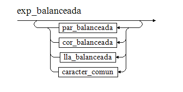
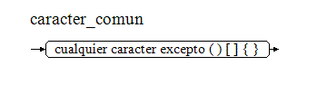
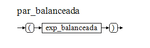
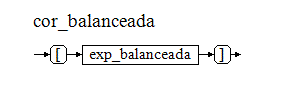
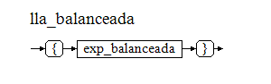

# Documentación: Verificador de Paréntesis Balanceados

**Archivo fuente:** [`parentesis_balanceado.c`](parentesis_balanceado.c)  
**Práctica:** Pilas dinámicas  
**Estudiante:** Alberto Martín Capurro  
**Fecha:** 2026-07-18  

Este verificador determina si una cadena de texto tiene sus paréntesis `()`, corchetes `[]` y llaves `{}` correctamente emparejados.  
Utiliza una pila dinámica como memoria auxiliar para recordar las aperturas pendientes.

## Gramáticas
- **BNF**: [`parentesis_balanceado.bnf`](parentesis_balanceado.bnf)

- **EBNF**: [`parentesis_balanceado.ebnf`](parentesis_balanceado.ebnf)

## Diagramas de Sintaxis

### Expresión Balanceada

### Carácter Común

### Paréntesis Balanceados

### Corchetes Balanceados

### Llaves Balanceadas

## Notas
>`caracter_comun` representa cualquier carácter que no sea `(`, `)`, `[`, `]`, `{` o `}`. No se enumeran explícitamente por brevedad.